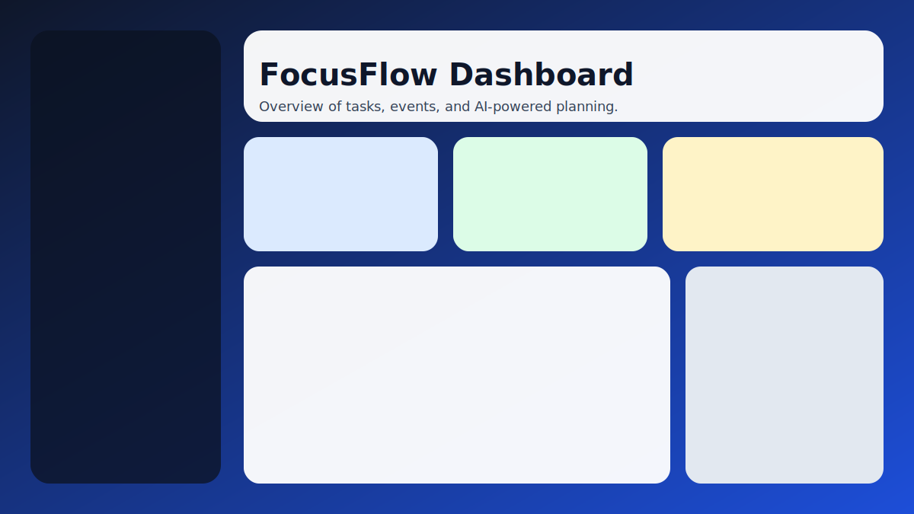
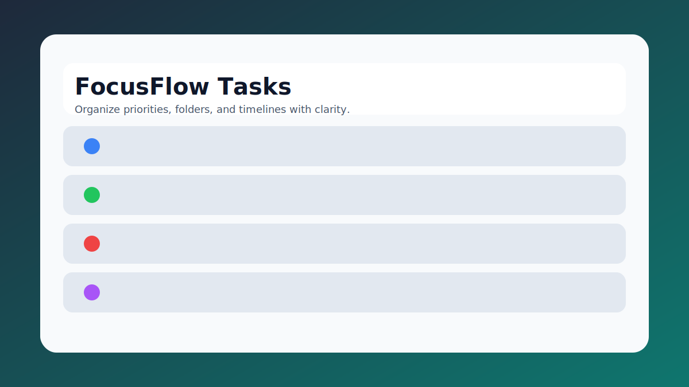
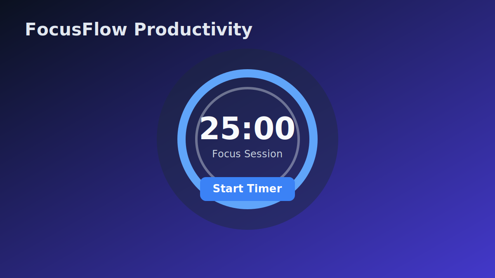

# FocusFlow

FocusFlow is a modern productivity web app built with React and Vite to manage tasks, notes, events, and focus sessions in one streamlined workspace.

FocusFlow la ung dung nang suat hien dai duoc xay dung bang React va Vite, giup ban quan ly cong viec, ghi chu, su kien va phien tap trung trong mot khong gian thong nhat.


## Live Demo

- Production: https://minhquangnguyen321.github.io/focusflow/

## Product Preview





## Key Features | Tinh nang noi bat

- Smart dashboard with real-time productivity overview
- AI assistant flow for creating tasks and events from natural language
- Task and note management with clean UX and fast interactions
- Focus mode timer for deep-work sessions
- Optional Google Calendar integration
- PWA-ready installable web experience
- Bilingual-ready UX foundation (English and Vietnamese)

## Tech Stack

- React 18
- Vite 5
- Tailwind CSS
- Framer Motion
- Firebase
- Google OAuth
- vite-plugin-pwa

## Project Structure

```text
public/
  previews/             README preview visuals
  favicon.svg           App icon
src/
  components/           Feature and UI components
  lib/                  Shared utilities (i18n, firebase)
  pages/                Main app pages
index.html              Application shell
vite.config.js          Vite + PWA configuration
```

## Quick Start

### 1. Clone repository

```bash
git clone https://github.com/MinhQuangNguyen321/focusflow.git
cd ai-todo
```

### 2. Install dependencies

```bash
npm install
```

### 3. Create local environment file

```bash
cp .env.example .env.local
```

Required environment variables:

```env
VITE_FIREBASE_API_KEY=
VITE_FIREBASE_AUTH_DOMAIN=
VITE_FIREBASE_PROJECT_ID=
VITE_FIREBASE_STORAGE_BUCKET=
VITE_FIREBASE_MESSAGING_SENDER_ID=
VITE_FIREBASE_APP_ID=
```

Optional environment variables:

```env
VITE_GOOGLE_CLIENT_ID=
VITE_GEMINI_API_KEY=
```

### 4. Run in development

```bash
npm run dev
```

## Scripts

```bash
npm run dev       # Run local dev server
npm run build     # Build production bundle
npm run preview   # Preview production build locally
npm run deploy    # Publish dist to GitHub Pages
npm run lint      # Run ESLint
```

## Deployment (GitHub Pages)

- Deploy target branch: gh-pages
- Base path: /focusflow/
- Deploy command:

```bash
npm run deploy
```

If the site appears blank after deployment:

- Hard refresh with Ctrl + F5
- Test in Incognito mode
- Confirm latest gh-pages commit is published
- Verify assets resolve from /focusflow/assets/

## Security Notes

- Never commit .env.local
- Treat API keys as secrets
- For production-grade Gemini integration, use a backend or serverless proxy to protect keys

## Known Build Notes

- Current build may show duplicate-key warnings in src/lib/i18n.jsx
- Keep translation keys unique to avoid warning noise

## Roadmap

- Secure server-side AI gateway
- Better code splitting for smaller bundles
- Richer analytics and reporting widgets
- Expanded test coverage

## Changelog

### v0.3.0 - 2026-04-05

- Rebranded app identity from AI Todo to FocusFlow
- Updated GitHub Pages base path to /focusflow/
- Improved README with bilingual documentation and visual previews

### v0.2.0 - 2026-04-05

- Added Gemini-powered AI assistant integration
- Expanded dashboard and feature-level UI updates

### v0.1.0 - Initial release

- Core productivity workspace with tasks, notes, calendar, and focus mode

## Author

Minh Quang Nguyen

## License

This project is licensed under the MIT License.
See LICENSE for full terms.
